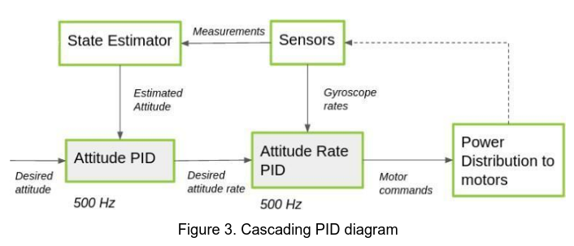

# cpre488-mp4

MP-4: UAV Control

Big Items:
1.     Implementing Embedded Control
2.     PID Control Basics 
3.     Debugging over telemetry

## Crazyflie System Overview



Figure 2. Crazyflie control diagram

The control process starts with the state estimator module receiving sensor data and using it to calculate the drone's current attitude (its rotation, i.e. roll, pitch, and yaw). The state estimator then sends the calculated attitude to the state controller module, which also receives a set-point from the commander module (in our case, this is user input specifying the desired attitude or attitude rate and thrust). The state controller module contains a cascading **PID** controller that uses the inputs from the state estimator to calculate the actuation force needed. That is then sent to the power distribution module where the actuation force is converted to motor power then the loop starts over again.

The Crazyflie runs off of a cascaded **PID** system where the output of the first **PID** controller is then used as an input for a second **PID** controller. This layout can be seen in figure 3, the output from the attitude **PID** controller, the desired attitude rate, becomes the input of the attitude rate **PID** controller. In part 2, we  implemented the attitude and attitude rate **PID** controllers for roll, pitch, and yaw. In part 1, we determined the **PID** values that should be present in the controllers by using a working **PID** controller before implementing it ourselves.

## Building Firmware

We found it useful to have a script for creating new configurations for building and flashing firmware to different drones as it kept our iteration times as short as possible.

We mounted our git repository onto the root of the virutal-machine by clicking `[Tab Item]` Devices -> Shared Folders, then adding a new folder that we would `cd` into each time we wanted to make firmware changes. Then we would just execute the `vm.sh` script to update the files in the part 2 software folder with their newest replacements. 

Reload in VM bash script (Copies git maintained files from a mounted git repo in the VM to the correct places to build firmware and generates a correct config.mk files for the specified drone)

```bash
#!/usr/bin/bash
# Function to display usage information
show_usage() {
    echo "Usage: $0 [-n CRAZYFLIE_NUMBER]"
    echo "If -n is not provided, you will be prompted for the CrazyFlie number."
}

# Function to get channel number from CrazyFlie number
get_channel() {
    local cf_number=$1
    
    case $cf_number in
        4)  echo "40" ;;
        5)  echo "50" ;;
        7)  echo "70" ;;
        8)  echo "80" ;;
        11) echo "100" ;;
        12) echo "95" ;;
        16) echo "85" ;;
        17) echo "65" ;;
        0)  echo "30" ;;  # For unlabeled
        *)  echo "Invalid CrazyFlie number" >&2; exit 1 ;;
    esac
}

# Parse command line arguments
cf_number=""
while getopts "n:h" opt; do
    case $opt in
        n) cf_number=$OPTARG ;;
        h) show_usage; exit 0 ;;
        *) show_usage; exit 1 ;;
    esac
done

# If CrazyFlie number not provided, prompt for it
if [ -z "$cf_number" ]; then
    echo "Please enter your CrazyFlie number (use 0 for unlabeled):"
    read cf_number
fi

# Get channel number
channel=$(get_channel $cf_number)

# Check if channel is valid
if [[ $channel == "Invalid CrazyFlie number" ]]; then
    echo "Error: Invalid CrazyFlie number: $cf_number"
    exit 1
fi

# Existing script content
echo "controller_student copying..."
cp ./src/controller_student.c          ~/MicroCART/crazyflie_software/crazyflie-firmware-lab-part-2/src/modules/src/controller_student.c
echo "controller_student copied..."
echo "student_attitude_controller.c copying..."
cp ./src/student_attitude_controller.c ~/MicroCART/crazyflie_software/crazyflie-firmware-lab-part-2/src/modules/src/student_attitude_controller.c
echo "student_attitude_controller.c copied"
echo "student_pid.c copying..."
cp ./src/student_pid.c                 ~/MicroCART/crazyflie_software/crazyflie-firmware-lab-part-2/src/modules/src/student_pid.c
echo "student_pid.c copied"

echo "student_attitude_controller.h copying..."
cp ./src/student_attitude_controller.h ~/MicroCART/crazyflie_software/crazyflie-firmware-lab-part-2/src/modules/interface/student_attitude_controller.h
echo "student_attitude_controller.h copied"
echo "student_pid.h copying..."
cp ./src/student_pid.h ~/MicroCART/crazyflie_software/crazyflie-firmware-lab-part-2/src/modules/interface/student_pid.h
echo "student_pid.h copied"

# Config file generation
echo "Generating config file for CrazyFlie #$cf_number (Channel $channel)..."
echo "CLOAD_CMDS=-w radio://0/$channel/2M/E7E7E7E7E7" > ~/MicroCART/crazyflie_software/crazyflie-firmware-lab-part-2/tools/make/config.mk
echo "Config file generated successfully."

code ~/MicroCART/crazyflie_software/crazyflie-firmware-lab-part-2/
```

Sometimes Windows screws up the line endings of the vm.sh file so this script can be used to fix it:

```bash
sed -i 's/\r$//' vm.sh
```

## Reflections

Logging Blocks are a terrible idea. They are not only slow, but they are also very difficult to use. As there must be only 12 logging variables at a time, or else you crash the gui or, sometimes, the vm, to make any changes we had to be sure that we only had 12 variables being logged at a time excluding the test stand variables.

We think that if the logging were purely just a console output, it would be much easier to use. 


## Overall Summary
### Part 1
In part 1 of the lab, we used the GUI to tune the PID values for the attitude and rate PID controllers. We noticed that the PID values were quite high (300-800 for P, 0 - 10, for I and, 0 - 45, for D), which was a bit odd.

After some experimentation, we were able to fly in part 1! One thing we noticed is that when we set D to anything above around 0.1 for the attitude controller, the drone would start spinning out of control. We are not sure why this is the case since we did not look into the part 1 code.


### Part 2
Without the extension, we would have not gotten part 2 done! However, Dr. Jones graciously extended the lab so we got two more days to tackle our issues. We noticed that having just P (I and D set to zero) resulted in some odd behavior. The drone would rotate faster when commanding a faster rate to the rate controller, sometimes reverse when commanding a new rate, and would be at the wrong speeds. It was like it was "deciding its own setpoints" instead of using the ones we set.

After looking into the code, we noticed that we introduced a bug into the saturateInt16 function. We added an `int16_t` cast to the passed in float in the comparison to the 16-bit integer limit. This is wrong since we should be comparing the float which has a larger integer range than a 16-bit integer! So, if the float value was greater than the max 16-bit integer value, it would rollover, which is incorrect! In addition, we theorized that the motor control values would rollover if the commanded values for pitch, roll, and yaw were too large. The motor control values are 16-bit integers and are a function of the thrust, roll command, yaw command, and pitch command values. If these values are too large (like the 16-bit integer limit), a rollover could occur, causing the drone to reverse its direction and do all sorts of unexpected stuff! To solve this, we made our PID values much smaller for part 2 than part 1 and also limited the control values to around 15000.

Moving on, we got most of our rate PIDs working, but one in particular was not functional. We noticed that when we commanded just the pitch, it would spin out of control. After looking at the commanded pitch, roll, and yaw rate values in the GUI, we noticed that yaw and roll commanded values were huge, but the yaw and roll readings were not big at all compared to the pitch reading. We concluded that we needed some sort of "dominator" function that would see if the largest sensor reading (pitch, roll, or yaw) is much, much larger than the other sensor readings. If one of the other sensors readings is super tiny compared to the largest ones, it is treated as being zero. This makes it so we don't register small sensor readings when a large one is present since the smaller readings are usually caused by the large reading. Implementing this feature toned down those large roll and yaw commands, making it so we could command the pitch rate!

Finally, we tuned the attitude PID controller and adjusted some of the rate PID values and were able to fly the drone with our own code! Flight was fairly stable, but we noticed the drone would flip if we put the throttle too high while changing pitch or roll. We believe that this is due to an integer overflow of the motor control values since the change is quite sudden and causes the drone to divebomb. Overall, this lab was quite fun, challenging, and provided good practice tuning and writing our own PID loops!